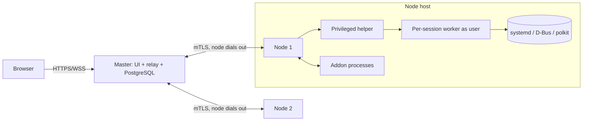
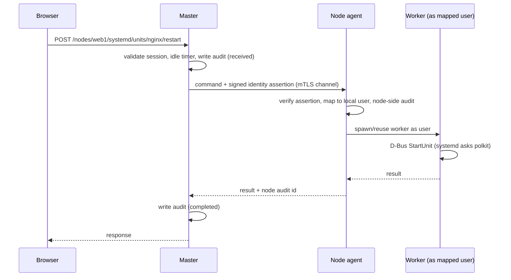

# Parfocal: System Design Draft 2

**Working title:** a modern, extensible Cockpit-style server management panel
**Status:** Draft v0.2
**Stack:** Go (backend and SSR UI) · PostgreSQL · systemd/D-Bus · polkit · sandboxed addons
**License:** GNU GPL v2 (see section 15 for two things to decide)
**Distribution:** tarball

### Changes since v0.1

| Area | v0.1 | v0.2 |
|---|---|---|
| Database | SQLite | **PostgreSQL** (master and standalone modes) |
| UI rendering | Static Astro build | **Server-side rendered by Go**, over TLS |
| Deployment | Single host | **Three modes: standalone, master, node** |
| Addon presentation | One model | **Embedded tool or separate site**, declared in manifest |
| Addon UI | Raw web tech only | **UI API mode or custom-components mode** (mutually exclusive) |
| Addon interaction | None | **Only via declared dependencies** |
| Authorization | Unix group + capabilities | **polkit** as the source of roles and privileged-action decisions |
| Sessions | Generic | **1 hour idle timeout for web sessions; terminal sessions exempt** |
| Audit | Privileged actions | **Every action** |
| Packaging | Unspecified | **Tarball**, GPL v2 |

---

## 1. Summary

A web panel for managing Linux servers (services, logs, terminal, files, storage, networking, containers) built on systemd and D-Bus, with three goals:

1. **A better UI:** modern, fast, consistent, server-rendered.
2. **A first-class addon system:** addons are sandboxed processes with either a declarative UI or fully custom UI, able to depend on each other.
3. **A hard permission boundary:** addons do only what their granted capabilities allow and never more than the user could do, unless a high-ranking user explicitly enables *direct access*.

**One binary, three roles.** The same Go program runs as a *standalone* panel for its own host, as a *node* that takes orders from a master, or as a *master* that serves the UI and relays work to nodes.

### Non-goals (v1)

- Non-systemd distributions (the design deliberately relies on systemd and D-Bus)
- Multi-tenant hosting
- High-availability master (designed for, not built)
- Matching Cockpit's full module breadth on day one

---

## 2. Requirements

### 2.1 Functional

| # | Requirement |
|---|---|
| F1 | Log in with existing Unix accounts via PAM |
| F2 | Manage systemd units (list, status, start/stop/restart, enable/disable) |
| F3 | Live journal log streaming with filtering |
| F4 | Browser terminal |
| F5 | File browser with resumable upload/download |
| F6 | Live metrics |
| F7 | Install, update, enable, disable, remove addons |
| F8 | Addons run as either a custom tool inside the panel or a separate site alongside it, per manifest |
| F9 | Addon UI via the manifest UI API, or custom components with author-defined routes |
| F10 | Addons call system functions only through the capability-checked API |
| F11 | Addons call other addons only if they declare them as dependencies |
| F12 | Opt-in direct access for addons, restricted to high-ranking users, with warning and legal notice on every enable |
| F13 | Web sessions expire after 1 hour idle; terminal sessions do not |
| F14 | Run as standalone, node, or master |
| F15 | Master manages nodes: enrollment, command relay, UI for any node |
| F16 | Audit log entry for every action |
| F17 | Everything the UI does is available through the public API |

### 2.2 Non-functional (assumptions)

| Area | Target |
|---|---|
| Users | 1–20 concurrent admins |
| Fleet | Up to ~100 nodes per master in v1 |
| Addons | 10–30 installed per host, ~10 running |
| Latency | API p95 < 100 ms; terminal echo < 50 ms on LAN; node command relay adds < 50 ms on LAN |
| Footprint | Node agent idle < 50 MB; standalone gateway idle < 100 MB (excluding PostgreSQL) |
| Security | A compromised gateway or addon must not yield root on the host |
| Platform | Linux with systemd (assumed 250+, verified at install) and D-Bus |

### 2.3 Constraints

- Go for backend and UI rendering.
- PostgreSQL is required in **standalone** and **master** modes; **node** mode is database-less.
- All external traffic is TLS. polkit is the authorization authority for privileged actions.
- GPL v2 licensed; distributed as a tarball.

---

## 3. Deployment Modes and Architecture

| Mode | Serves UI | Talks to | Database | Manages |
|---|---|---|---|---|
| **Standalone** | Yes | Local systemd/D-Bus | PostgreSQL | The host it runs on |
| **Master** | Yes | Nodes (over mTLS) | PostgreSQL | Nodes, through them; not its own host unless a node agent also runs there |
| **Node** | **No** | Master (outbound mTLS) | None | The host it runs on, on master's instruction |

Because the master does no host work itself, run a node agent on the master's machine if that host should also be managed.



Standalone is the same picture with the master and the node collapsed into one host and no mTLS hop.

### 3.1 Components

**Gateway (Go, unprivileged).** Network-facing process. In standalone/master mode: terminates TLS, renders the UI (SSR), exposes REST and WebSocket APIs, owns sessions, issues addon tokens, enforces capabilities, writes audit records. In node mode: no listening UI or API; only the outbound master link.

**Node agent (Go, unprivileged).** The node-mode replacement for the gateway. Maintains the outbound mTLS connection, verifies master-signed identity assertions, dispatches work to workers and addons, keeps a local audit journal.

**Privileged helper (Go, tiny, root).** Reachable only over a local unix socket from the gateway/agent uid. Does PAM authentication (standalone/master) and spawns per-session workers as the target Unix user. Its surface is deliberately small.

**Per-session worker (Go, runs as the acting user).** Does the actual system work *as that user*: D-Bus calls, `journalctl`, PTY, files. The kernel and polkit decide what it may do.

**Addon runtime.** Each addon backend is its own sandboxed process (section 7.4).

**UI renderer.** Go renders HTML for the shell, built-in modules, and addons in UI-API mode using trusted components. Small client-side islands (web components) provide interactivity: terminal, charts, log viewer.

### 3.2 Why this shape

- The exposed component (gateway) has no privileges; the privileged component (helper) is not network-reachable.
- Real work runs with the user's rights, so an app-level permission bug does not become root.
- The node agent has no UI and no inbound ports, which shrinks the attack surface of every managed host to the minimum.
- Nodes dial out, so they work behind NAT and strict firewalls.

---

## 4. Identity, Sessions, and polkit

### 4.1 Authentication

- **Standalone/master:** PAM through the helper. Because PAM goes through the host's stack, SSSD-backed LDAP/AD accounts work without extra code. OIDC is a later option.
- **Node:** does not authenticate humans. It trusts short-lived **identity assertions** signed by the master (4.4).

### 4.2 polkit as the authorization authority

Two kinds of decisions go through polkit:

1. **System actions** (start a unit, set hostname, manage storage). The worker runs as the user and calls D-Bus, so systemd, NetworkManager and the rest already ask polkit.
2. **Panel actions**, declared in the panel's own `.policy` file, for example:

| polkit action | Guards |
|---|---|
| `org.serverpanel.addon.install` | Installing/removing addons |
| `org.serverpanel.addon.grant` | Approving addon capabilities |
| `org.serverpanel.addon.direct-access` | Enabling direct access (**the "high-ranking user" check**) |
| `org.serverpanel.node.enroll` | Enrolling or revoking nodes |
| `org.serverpanel.audit.read` | Reading the audit log |
| `org.serverpanel.settings.write` | Changing panel configuration |

The helper calls polkit's `CheckAuthorization` with the worker process as the subject. Site admins tune who holds each action with standard polkit `.rules` files, so "who is high-ranking" is ordinary polkit policy rather than a parallel role system.

**Interactive authentication:** when polkit answers "authentication required" (for example `auth_admin`), the worker registers a polkit authentication agent and the UI prompts for the password inline, as Cockpit does.

### 4.3 Sessions and idle revocation

- Session cookie: `HttpOnly; Secure; SameSite=Strict`, stored server-side in PostgreSQL.
- **Web session idle timeout: 1 hour.** Idle is measured from the last *user-initiated* request. Passive traffic (live log streams, metrics polling) is marked passive by the client and does not refresh the timer, so an unattended page cannot keep a session alive forever. (The marking is client-declared, but it only affects that user's own session.)
- On expiry: the session is revoked, all non-terminal channels close, and every addon token and addon-site session derived from it dies with it.

**Terminal sessions are exempt.** Implementation:

- A terminal channel holds a **terminal lease** (session id, PTY id, worker, last I/O time). The PTY and its WebSocket survive the web session's expiry.
- After expiry, that session can no longer do anything else, and cannot *open new* terminals. Re-authentication reattaches the user to their existing leased PTYs.
- Recommended safeguard (open question 4): configurable `terminal.idle_timeout` and `terminal.max_lifetime`, defaulting to none per the requirement, because an abandoned terminal, especially one holding a fresh `sudo` timestamp, is a standing open door.

### 4.4 Identity across master and nodes

The node's kernel and polkit need a *local* Unix identity to enforce rights, but the user authenticated at the master. Design:

1. Master authenticates the user (PAM/SSSD on master).
2. For each request to a node, master signs a short-lived **identity assertion**: user, session id, target node id, nonce, expiry (about 60 seconds).
3. Node verifies the signature against the pinned master key, then maps the master identity to a **local Unix user** using an admin-managed mapping (default: same username; root mapping must be explicitly allowed).
4. The node's helper spawns the worker as that user; polkit on the node makes the local decision.

Consequence to accept: a compromised master can assert any *mapped* identity on any node. Mitigations: non-root mappings by default, node-side polkit still applies, both sides write audit records, assertions are short-lived and audience-bound.

### 4.5 Node enrollment and transport

- An admin (polkit-authorized) creates a **one-time enrollment token** on the master.
- The node presents the token and a CSR; master acts as a small internal CA and returns a client certificate, and the node pins the master's identity.
- Certificates are short-lived (for example 30 days) and auto-renewed; revocation removes the node's trust immediately.
- The node holds **one outbound mTLS WebSocket** to the master. It carries the same multiplexed channel protocol as browser-to-gateway (section 8), so there is one protocol to build and test.
- If the node is offline, master shows it offline. Mutating commands are **not** queued beyond a short TTL (for example 60 seconds), to avoid surprise replays.

---

## 5. TLS

- TLS 1.2+ (1.3 preferred) for all listeners; HSTS on the panel origin.
- Certificate sources: provided cert/key, built-in ACME (HTTP-01 or DNS-01), or a self-signed bootstrap certificate whose fingerprint is displayed at first run.
- Master-to-node links use mTLS with the internal CA, independent of the public certificate.
- Wildcard DNS and certificate are needed only for the subdomain style of addon site and iframe isolation (7.3); a port-based fallback exists.

---

## 6. Trust Model and Permissions

### 6.1 Actors

| Actor | Trust | Identity |
|---|---|---|
| Logged-in user | Up to their Unix rights and polkit grants | Session cookie |
| High-ranking user | Holds specific polkit panel actions | Same, plus polkit |
| Addon UI code (custom mode) | Untrusted | Scoped addon token |
| Addon backend | Untrusted | Its uid, verified by `SO_PEERCRED` |
| Gateway / node agent | Semi-trusted (unprivileged) | n/a |
| Master (from a node's view) | Trusted to assert mapped identities | Pinned key + mTLS |
| Helper | Trusted, minimal | n/a |

### 6.2 The two-gate rule (standard mode)

```
allowed = (the user could do it as their own Unix identity, per kernel/polkit)
          AND (the addon holds the matching capability)
```

Gate 1 is enforced by the OS because the worker acts as the user. Gate 2 is enforced by the gateway or node agent on every call. An addon can only *narrow* what a user can do through it.

### 6.3 Capabilities

Declared in the manifest, approved by someone holding `addon.grant`, re-approved on any change.

| Capability | Meaning |
|---|---|
| `systemd.units:read` | List units and status |
| `systemd.units:control` | Start/stop/restart (optionally scoped by glob) |
| `journal:read` | Read logs (optionally per unit) |
| `files:read:<path>` / `files:write:<path>` | Path-scoped file access |
| `net:outbound` | Outbound network from the addon process |
| `storage:own:<quota>` | Private persistent storage |
| `addon.call:<id>` | Call a declared dependency (see 7.5) |
| `ui:nav`, `ui:notify` | Navigation entries, notifications |

### 6.4 Direct access mode

An addon that needs more than the capability API declares a `direct_access` entry per scope in its manifest (for example `direct:shell`, `direct:dbus`, `direct:fs`).

Required by the design:

1. The addon **must declare** it in the manifest.
2. Only a user holding `org.serverpanel.addon.direct-access` (high-ranking) can enable it.
3. **Every enable** shows a warning dialog with a legal notice that must be accepted.

Recommended additions (open question 9):

- Time-box the grant (for example 8 hours) and show a persistent banner while active.
- Keep granular scopes instead of a single switch.
- **Protected resources stay off-limits even in direct mode:** panel config, addon store, PostgreSQL credentials, the audit log, helper socket, and the master's CA key.
- Direct access still runs as the acting user's uid, never implicit root.
- Direct-mode actions carry a distinct audit flag.

> A legal notice addresses consent and liability, not host safety. Get legal review of the wording (I'm not a lawyer). The technical limits above are what protect the host.

---

## 7. Addon System

### 7.1 Package layout

```
my-addon/
├── manifest.json
├── ui/                # compiled HTML/CSS/JS (custom mode) or page definitions (UI API mode)
├── bin/               # backend executable(s), any language
└── signature
```

TypeScript is compiled before packaging (browsers cannot run `.ts`); a `panel-addon build` command wraps esbuild so authors can write TS and CSS and get a correct package.

### 7.2 Manifest (draft)

```json
{
  "id": "com.example.backup-manager",
  "name": "Backup Manager",
  "version": "1.2.0",
  "publisher": "example.com",
  "api_version": "1",

  "presentation": "embedded",
  "site": null,

  "ui": {
    "api": true,
    "pages": [
      { "path": "/", "title": "Backups", "view": "views/overview" }
    ],
    "custom": null
  },

  "backend": { "exec": "bin/backup-manager", "restart": "on-failure" },
  "placement": { "backend_runs_on": "node", "ui_served_by": "master" },

  "capabilities": [
    { "cap": "systemd.units:read" },
    { "cap": "files:read", "path": "/srv/data" },
    { "cap": "storage:own", "quota": "500MB" }
  ],
  "dependencies": [
    { "id": "com.example.storage-tools", "version": "^1.0", "optional": false }
  ],
  "exports": [
    { "name": "backup.run", "requires": ["systemd.units:control"] }
  ],
  "direct_access": [],
  "limits": { "cpu_weight": 50, "memory_high": "128M", "memory_max": "256M", "tasks_max": 64 }
}
```

### 7.3 Presentation modes (`presentation`)

| Mode | What it is | Serving and isolation |
|---|---|---|
| `embedded` | A custom tool inside the panel, appearing in the panel's navigation | UI API pages are rendered by the panel itself. Custom-mode pages load in an isolated iframe |
| `site` | A separate site alongside the panel, on its own hostname or port | Panel's TLS listener routes by host/port; its own origin by construction |

For `site`, a **one-time-code SSO handshake** gives the addon site a host-only session cookie. That cookie is not valid against the panel API, and it dies when the parent web session expires.

### 7.4 UI modes (`ui.api`)

The two modes are **mutually exclusive per addon**. This is my reading of the requirement; see open question 3.

**`ui.api: true` (UI API mode).** The addon describes its UI through the panel's high-level UI API, using the panel's component set (tables, forms, charts, log viewer, terminal, dialogs). Its backend returns a UI description; the panel renders it server-side with trusted components and routes UI events back to the addon backend. **No addon JavaScript runs in the browser**, which makes this the safest mode and consistent in look and feel. No origin isolation is needed.

**`ui.api: false` (custom mode).** The UI API is disabled. The addon ships its own components and defines its own **routes** in the manifest (path to component/entry), built with HTML, CSS, and TS. This is arbitrary browser code, so it must be isolated:

- Serve from an isolated origin (`<addon>.addons.<host>` or its own port), or from a sandboxed iframe using `Content-Security-Policy: sandbox allow-scripts` (opaque origin) with a `postMessage` bridge.
- Authenticate with a short-lived scoped token (`addon_id`, `user_id`, `session_id`, `exp`; about 5 minutes; refreshed by the shell).
- Per-addon CSP: `default-src 'self'`; `connect-src` limited to the addon's own API prefix.
- A provided JS/TS SDK handles tokens, calls, and streaming.
- Optionally use the panel's web-component library and theme tokens so custom addons still look native.

### 7.5 Process sandbox

Each addon backend is started as a **systemd transient unit** on the host where it runs (a node, or standalone host).

| Concern | Mechanism |
|---|---|
| Identity | `DynamicUser=yes` (unique uid, enables `SO_PEERCRED` identification) |
| Filesystem | `ProtectSystem=strict`, `ProtectHome=yes`, `PrivateTmp=yes`, `StateDirectory=` |
| Privileges | `NoNewPrivileges=yes`, empty capability bounding set |
| Syscalls | `SystemCallFilter=@system-service` (tighten as possible) |
| Network | `PrivateNetwork=yes` by default; `net:outbound` opens it |
| Only exit | A unix socket to the local gateway/agent |

**Burstable resources (cgroup v2):** `CPUWeight` (fair share, bursts when idle), `MemoryHigh` (soft throttle), `MemoryMax` (hard OOM-kill inside the cgroup), `TasksMax` (fork-bomb guard), `IOWeight`.

Limitation: per-destination network allowlists are not provided by plain systemd. v1 offers `net:outbound` on/off; a later version can route addon traffic through a proxy with an allowlist.

### 7.6 Addon-to-addon interaction

Addons may interact **only** if the caller lists the callee in `dependencies`.

- The callee lists what it offers in `exports`. Calls to anything not exported are rejected.
- All calls go **through the gateway/agent**, never socket-to-socket, so they are checked, attenuated, and audited. Across nodes they are routed via the master.
- At install, the approver sees "A depends on B and may call B's exports X, Y" and approves the link. Dependencies are resolved by version range; install order follows the graph; removing an addon that others depend on is blocked; cycles are rejected.
- **Attenuation rule (recommended default):** during a call chain, the callee runs with the *intersection* of the caller's and callee's capabilities. This prevents **capability laundering**, where a weak addon borrows a strong addon's permissions. Full callee rights can be granted per link by an explicit approval.
- Each audit record for a chained call includes the whole call chain.

### 7.7 Supply chain

- Packages are signed by the publisher and verified against trusted keys.
- Capability or dependency changes on update require re-approval.
- Local unsigned install is allowed for authorized users and flagged.
- Later: a registry with publisher verification and revocation.

---

## 8. API Design

### 8.1 Style

- **REST + JSON**, documented in **OpenAPI**, with generated SDKs (TypeScript for addon UIs, Go and others for addon backends).
- **WebSocket** with a multiplexed **channel** protocol (open/data/close/error, flow control): `logs`, `terminal`, `metrics`, `file-watch`. The same protocol runs browser-to-gateway and node-to-master.
- Errors use **RFC 9457** `problem+json` with stable codes. Versioned under `/api/v1`. Mutating calls accept `Idempotency-Key`.
- In master mode, every resource endpoint accepts a node selector (`/api/v1/nodes/{node}/...`); the master relays to the node.

### 8.2 Core endpoints (illustrative)

| Method | Path | Purpose |
|---|---|---|
| POST | `/api/v1/auth/login`, `/logout` | PAM login / logout |
| GET | `/api/v1/me` | Current user and polkit-derived abilities |
| GET | `/api/v1/[nodes/{n}/]systemd/units` | List units |
| POST | `/api/v1/[nodes/{n}/]systemd/units/{name}/{action}` | Unit control |
| GET | `/api/v1/[nodes/{n}/]ws` | Channel socket |
| GET/PUT | `/api/v1/[nodes/{n}/]files…`, `/uploads/{id}` | Files, resumable upload |
| GET/POST | `/api/v1/addons`, `/addons/{id}/grants`, `/addons/{id}/direct-access` | Addon lifecycle and approvals |
| POST | `/api/v1/nodes/enroll-tokens`, GET `/api/v1/nodes` | Node enrollment and status |
| GET | `/api/v1/audit` | Query audit log |
| ANY | `/addon-api/{id}/*` | Token-authenticated route to an addon backend |

Uploads and downloads are streamed by the worker as the acting user (file permissions apply naturally), chunked and resumable, written to a temp file then atomically renamed.

---

## 9. Data Model (PostgreSQL)

Used by **standalone** and **master**. Nodes store no application state: config and certificates live under `/etc`, and their local audit journal is a file.

| Table | Key fields |
|---|---|
| `sessions` | id, unix_user, created_at, last_user_activity, expires_at, revoked_at, ip, user_agent |
| `terminal_leases` | id, session_id, node_id, pty_id, opened_at, last_io_at, closed_at |
| `nodes` | id, name, cert_fingerprint, enrolled_by, enrolled_at, last_seen, state, agent_version |
| `enroll_tokens` | id, token_hash, created_by, expires_at, used_at |
| `addons` | id, version, publisher, manifest_json, signature_status, state, installed_by |
| `addon_installs` | addon_id, node_id, state, installed_at (where the backend runs) |
| `addon_grants` | addon_id, capability, params_json, granted_by, granted_at, manifest_version |
| `addon_dependencies` | addon_id, depends_on_id, version_range, approved_by, attenuation_mode |
| `direct_access_grants` | addon_id, node_id, scope, granted_by, granted_at, expires_at, legal_ack_version, legal_ack_at |
| `audit_events` | see section 11 |
| `settings` | key, value |

**Database hardening:**

- Separate roles: a migration/admin role and a runtime application role. The runtime role has **INSERT-only** on `audit_events` (no UPDATE/DELETE).
- Migrations are versioned and applied at upgrade.
- Backups by `pg_dump` or WAL archiving; the panel documents a recommended schedule.
- PostgreSQL is an **external dependency** the tarball installer checks for; it does not bundle a database (open question 7).

---

## 10. Key Flows

### 10.1 Login (standalone/master)

1. Browser posts credentials over TLS to the gateway.
2. Gateway asks the helper to run PAM; helper returns uid and groups, never the password.
3. Gateway creates the session row and sets the cookie.
4. The first privileged request makes the helper spawn a worker as that user.

### 10.2 Action on a node via master



### 10.3 Addon action with a dependency

1. Addon A's backend needs `backup.run` from B and calls the local gateway/agent with its socket.
2. Gateway identifies A by `SO_PEERCRED`, confirms A lists B, B exports `backup.run`, and the link was approved.
3. Effective capabilities for the call = A's ∩ B's (attenuation); user rights still apply through the worker.
4. B executes; the audit record stores the full chain (user → A → B).

### 10.4 Enabling direct access

1. Addon manifest declares scopes; a user with `addon.direct-access` opens the addon settings.
2. polkit authorization for the action (prompting if required), then the **warning and legal notice** must be accepted.
3. Grant, acknowledgement version/time, and expiry (if adopted) are recorded and audited; banner appears.

---

## 11. Audit

**Rule:** every action is audited, at both the master and the executing node.

| Aspect | Design |
|---|---|
| Coverage | Every authenticated API call, addon call, polkit decision, login/logout, session expiry, grant, and direct-access event. High-volume streams are logged at channel open and close (with byte counts), not per message |
| Fields | id, ts, node_id, actor_user, mapped_local_user, addon_id, call_chain, action, target, polkit_result, outcome, direct_mode, source_ip, session_id, prev_hash, hash |
| Integrity | Hash-chained records, INSERT-only DB role, monthly partitions |
| Node resilience | Node keeps a local append-only journal and forwards it to the master; buffered on disk when the master is unreachable and reconciled on reconnect |
| Failure policy (recommended) | **Fail closed for mutating and privileged actions** if the audit record cannot be written; reads may buffer briefly |
| Export | Optional forwarding to syslog/journald/remote store so a compromised host cannot rewrite history |
| Retention | Configurable, default 90 days (assumption) |
| Read access | Requires `org.serverpanel.audit.read` |

---

## 12. Error Handling and Retry

| Situation | Behavior |
|---|---|
| Worker crash | Detected via stdio closure; respawned on next request; in-flight calls return retryable `503 worker_unavailable` |
| Addon crash | systemd restart with backoff; after N failures in a window, marked failed and admins notified |
| Addon exceeds `MemoryMax` | OOM-killed within its cgroup; host unaffected; audited |
| Capability denied | `403 capability_denied` naming the missing capability; audited |
| Node offline | Master returns `503 node_unreachable`; UI shows node state; no long-lived command queue |
| Node link drop | Node reconnects with backoff and jitter; channels resume where possible; terminal PTYs on the node persist |
| Master DB unavailable | Master goes read-only/unavailable (fail closed); nodes keep running workloads and buffer audit |
| Idle expiry mid-action | Long-running operations already started finish; new requests get `401 session_expired` |
| Upload interrupted | Client resumes from last acknowledged chunk |

Client retry guidance: retry only `503` and network errors, with exponential backoff and jitter, and only non-idempotent calls carrying an `Idempotency-Key`.

---

## 13. Scale and Reliability

### 13.1 Load estimation (assumptions)

- 20 admins × 1 WebSocket × ~4 channels ≈ 80 streams; aggregate well under 1 MB/s.
- 100 nodes = 100 persistent mTLS connections plus heartbeats and metrics: comfortably handled by one Go process.
- Audit volume: even at ~5 events/s sustained (peak admin activity including reads) is ~430k rows/day; partitioning and a 90-day default keep PostgreSQL small.
- Per node: ~10 addons × 128 MB `MemoryHigh` ≈ 1.3 GB worst case; typical is far lower, and budgets are visible in the UI.

### 13.2 Scaling and failover

- **v1:** one master (or standalone), vertical scaling. The master link is stateless enough to restart quickly, since sessions and grants live in PostgreSQL.
- systemd `Restart=on-failure` for gateway, agent, and helper.
- **Master down:** managed workloads are unaffected, but management is unavailable and node audit buffers on disk. The panel being down never stops what it manages.
- **Later:** active/passive master with a PostgreSQL replica.

### 13.3 Upgrades and version skew

- Masters and nodes upgrade independently, so the link protocol is **versioned with negotiation**, and masters support at least the previous node version (N-1).
- Database migrations run at master/standalone upgrade with a documented backup-first step.

### 13.4 Monitoring

- Structured logs to journald; `/metrics` (Prometheus) on a local socket or loopback: requests, errors, sessions, connected nodes, per-addon cgroup CPU/memory, capability denials, audit write failures.
- `/healthz` and `/readyz` (PostgreSQL reachable, helper reachable, node link up).
- Suggested alerts: node offline, addon crash loops, `capability_denied` spikes, direct access enabled, audit failure, certificate near expiry.

---

## 14. Threat Model (summary)

| Threat | Mitigation |
|---|---|
| Gateway compromised | Unprivileged; helper surface tiny and socket-restricted; work is done by per-user workers |
| **Master compromised** | Assertions are short-lived and audience-bound; non-root mappings by default; node-side polkit and audit; nodes never accept unsigned commands. Residual risk is real: the master is the fleet's crown jewel, so harden and isolate it |
| Node certificate stolen | Short-lived certs, immediate revocation, master pins certificate fingerprints |
| Addon UI steals session or hits panel API | UI API mode ships no addon JS; custom mode uses isolated origin/sandboxed iframe, scoped tokens, per-addon CSP |
| Addon backend escapes | systemd sandbox, unique uid, seccomp, no network by default, cgroup limits |
| Addon impersonates another | `SO_PEERCRED` identification, not self-declared names |
| **Capability laundering via dependencies** | Attenuation (intersection) by default; approved links only; chain audited |
| Confused deputy | Actions run as the user's uid; capability gate only narrows |
| Malicious update widens power | Re-approval on capability/dependency change; signatures |
| Direct access abused | Protected resources, audit flag, optional expiry and banner; still the user's uid |
| Abandoned terminal | Terminal lease timeouts (configurable), tie to user; visible list of open terminals |
| Credential theft / brute force | PAM only, no password storage, login throttling and lockout, secure cookies |
| CSRF / XSS | `SameSite=Strict`, CSRF tokens, `Origin` checks, strict shell CSP, escaped log output |
| polkit misconfiguration | Ship conservative default `.policy`/`.rules`; `panel doctor` command to flag risky rules |
| Tampered audit log | INSERT-only DB role, hash chain, external export |
| Tarball tampering | Published checksums and detached signature; installer verifies before install |

---

## 15. Packaging, Distribution, and Licensing

### 15.1 Tarball

```
serverpanel-<version>-linux-<arch>.tar.gz
├── bin/          # serverpanel (single binary; mode chosen by config), serverpanel-helper, panel-addon CLI
├── share/        # polkit .policy and default .rules, systemd unit templates, migrations
├── etc/          # example config per mode (standalone, master, node)
├── install.sh    # creates users/dirs, installs units and polkit files, checks prerequisites
├── LICENSE       # GPL v2
└── SHA256SUMS + signature
```

- Static Go binaries for amd64 and arm64.
- `install.sh` needs root, verifies systemd, D-Bus, polkit, and (for standalone/master) a reachable PostgreSQL; it does not install PostgreSQL itself.
- Mode is a config setting (`mode = standalone | master | node`); `serverpanel enroll <master-url> <token>` handles node enrollment.
- Upgrades: replace binaries, run migrations on master/standalone, restart units. Package-manager repos are a later option.

### 15.2 License: GNU GPL v2

Two things to decide, because they affect what you can ship:

1. **"only" vs "or later".** As far as I know, Apache-2.0 code is not compatible with GPL-2.0-*only*. Many Go libraries are Apache-2.0 (for example `coreos/go-systemd`). GPL-2.0-*or-later* avoids this, because the combined work can be distributed under GPLv3, which is Apache-compatible. Alternatively avoid Apache-2.0 dependencies. Audit the dependency list before choosing.
2. **Addons and SDKs.** Addons are separate processes talking over sockets and HTTP, which is generally treated as arm's-length, but any SDK library that addons *link* is covered by the SDK's license. Consider a permissive license (MIT/BSD) or a linking exception for SDKs so proprietary addons remain possible.

I'm not a lawyer; have this reviewed.

Also note the panel's GPL license and the direct-access legal notice serve different purposes; the notice is about user consent, not licensing.

---

## 16. Decisions and Trade-offs

| # | Decision | Alternatives | Rationale | Cost |
|---|---|---|---|---|
| D1 | Go backend | Bun/Node | D-Bus, PTY, systemd ecosystem; static binaries | Team must know Go |
| D2 | **Go server-side renders the UI** | Astro SSR, static SPA | Single runtime, no extra hop, fits uploads/websockets, matches node/master model | Astro cannot be hosted by Go (its SSR needs a JS runtime), so its role changes (open question 1) |
| D3 | Gateway/helper/worker split | Single root daemon | Limits blast radius | More IPC |
| D4 | Work runs as the user's uid | App-level checks in a root process | Kernel enforces rights | Per-session workers |
| D5 | Addons as sandboxed processes | In-process plugins, WASM | Language freedom, real limits | More overhead per addon |
| D6 | Two UI modes, mutually exclusive | Single UI model | Safe default (UI API) plus escape hatch (custom) | Two paths to test |
| D7 | Embedded or site presentation | Embedded only | Flexibility for large addons | Host/port/TLS routing complexity |
| D8 | **PostgreSQL** | SQLite | Concurrency, INSERT-only audit role, master scale | Extra service to install and back up; heavier for a one-host standalone install |
| D9 | Three modes in one binary | Separate products | One codebase, one protocol | Mode-specific code paths and testing matrix |
| D10 | Nodes dial out over mTLS | Master dials nodes | NAT/firewall friendly, no inbound port on nodes | Master must be reachable; long-lived connections |
| D11 | Identity assertions + local mapping | Forward credentials; run all as root | No password leaves master; least privilege | Mapping admin burden; master compromise impact |
| D12 | polkit for roles and privileged actions | Custom RBAC | Native to systemd/D-Bus, admins already know it | polkit rule language and agent complexity |
| D13 | Dependencies gate addon-to-addon calls, with attenuation | Open inter-addon access | Prevents laundering, explicit graph | Dependency resolution work |
| D14 | Terminal exempt from idle expiry | Same timeout as web | Long-running interactive work | Risk of abandoned root-capable shells; mitigated by leases and configurable timeouts |
| D15 | Rely fully on systemd/D-Bus | Distro-agnostic | Less code, consistent behavior | Excludes non-systemd systems |
| D16 | Tarball distribution | Distro packages, containers | Simple, uniform | Manual upgrades until repos exist |

---

## 17. Delivery Plan

| Milestone | Scope | Exit criteria |
|---|---|---|
| **M0** Skeleton | Repo, Go SSR shell, TLS, config with `mode`, OpenAPI stub, CI, tarball build | Panel loads over TLS in standalone mode |
| **M1** Auth and core | Helper with PAM, workers, sessions in PostgreSQL, 1-hour idle expiry, units list/restart, audit v1. **Design the worker protocol transport-agnostic now** so it can later run over the node link | Log in, restart a unit, expire idle session, see audit rows |
| **M2** polkit | Panel `.policy`, `CheckAuthorization`, auth agent, admin-only actions | Non-admin denied, admin prompted and allowed |
| **M3** Streaming | Channel protocol, logs, metrics | Live logs with reconnect |
| **M4** Terminal and files | PTY channel with leases, files, resumable transfer | Terminal survives session expiry; 5 GB upload resumes |
| **M5** Addon runtime | Manifest, transient-unit sandbox, socket API, capability checks | Permitted call succeeds, non-permitted denied and audited |
| **M6** Addon UI | UI API mode first, then custom mode with isolation, tokens, SDK; embedded and site presentation | Custom addon cannot read panel cookies or reach non-addon routes (tested) |
| **M7** Master and node | Enrollment, mTLS link, assertions, identity mapping, relay, node audit journal | Restart a unit on a node from the master UI; node refuses forged assertion |
| **M8** Dependencies and direct access | Dependency graph, attenuation, direct-access flow with legal notice | Laundering attempt blocked; protected resources unreachable |
| **M9** Supply chain and hardening | Signing, re-approval, security review, fuzzing helper/gateway/link, isolation pen-test | Findings triaged and closed |
| **Later** | Master HA, addon egress proxy, registry, more modules | n/a |

The riskiest assumptions to validate early are the two-gate model with origin isolation (M5–M6) and the master-to-node identity model (M7).

---
