# Panel + Daemon — System Design (Draft 2, Elaborated)

> **Naming disclaimer:** Every proper noun in this document — `panel`, `daemon`, `tmz`, `.tmz`, `.tmz.sc`, `Location`, `Node`, route names, table names, binary names — is a working placeholder. Nothing here is final naming. Field names inside schemas are illustrative and meant to be refined during implementation, not copied verbatim.

> **Purpose of this document:** a single, comprehensive reference for the whole system as discussed so far — architecture, data model, protocols, and the reasoning behind each decision — so that implementation can start from something concrete instead of scattered notes. Sections marked **[OPEN]** are explicitly undecided and flagged rather than silently resolved.

---

## Table of contents

1. Overview & goals
2. Non-goals / explicit scope boundaries
3. Architecture
4. Repository layout
5. Data model (PostgreSQL schema)
6. Auth & identity
7. RBAC (roles, permissions, resource grants)
8. API design principles
9. API reference (endpoint catalog)
10. Locations & Nodes
11. Node bootstrap handshake
12. Panel ↔ Node control channel protocol
13. Backends: Docker & VM
14. Image templates (`.tmz`)
15. Install process
16. Server lifecycle
17. Port allocation
18. `tmz` — the in-guest agent
19. Console
20. File management
21. Backups
22. Databases (user-facing hosting)
23. Scheduler (`.tmz.sc`)
24. Assets / CDN
25. Addons (deferred)
26. Threat model summary
27. Open questions
28. Glossary

---

## 1. Overview & goals

A self-hosted control plane ("the panel") for managing a fleet of machines ("Nodes"), each running an agent ("the daemon"), capable of provisioning and running **Docker containers** and **QEMU/virtio VMs** from reusable, versioned **image templates**. Users are scoped to their own servers by default; Admins and a single Owner manage the fleet, users, and infrastructure.

Design priorities, in order:
1. **Safety of the trust boundaries** — a compromised guest (container or VM) must never be able to escalate into host or panel control. Every design decision involving the in-guest agent (`tmz`) is filtered through this.
2. **Operational simplicity** — prefer one well-understood mechanism over several half-built ones (e.g. Postgres-only rather than pluggable DBs; ordinary Go packages rather than git submodules for internal code).
3. **Backend parity** — Docker and VM servers should look identical from the panel's and the user's point of view wherever practical (console, file access, scheduling, power actions), even though the underlying mechanisms differ substantially.
4. **Human-editable configuration** — templates and schedules should be inspectable and hand-editable, not opaque blobs.

## 2. Non-goals / explicit scope boundaries

These were considered and deliberately cut from v1, recorded here so they aren't silently reconsidered mid-implementation:

- **Kubernetes support** — cut. A per-node daemon model doesn't map cleanly onto a cluster's own control plane; revisit only as a distinct, later integration (panel talking to an existing cluster's API, not the daemon reimplementing kubelet).
- **Bare-metal provisioning via hardware KVM/IPMI** — cut. Its own subsystem (PXE/imaging), unrelated in shape to Docker/VM provisioning.
- **Pluggable database backends** — cut. PostgreSQL only, hardcoded.
- **Automatic node placement / bin-packing** — cut for v1. Placement is manual (admin picks the node).
- **Runtime-loadable (dynamic) backend plugins** — cut. Docker and VM backends are compiled-in Go packages, not Go `plugin`-loaded or third-party-extensible yet.
- **API versioning (`/v1/`, `/v2/`)** — deliberately omitted. Accepted trade-off: the API must evolve additively (new fields/endpoints only) rather than via breaking version bumps.

## 3. Architecture

### 3.1 System overview

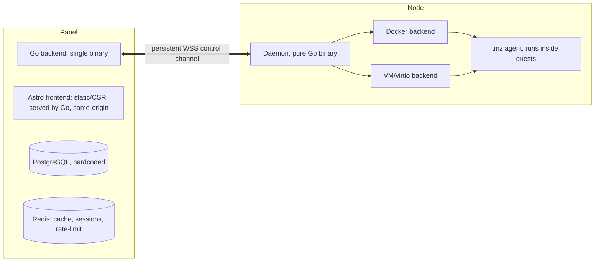

### 3.2 Detailed data-flow view

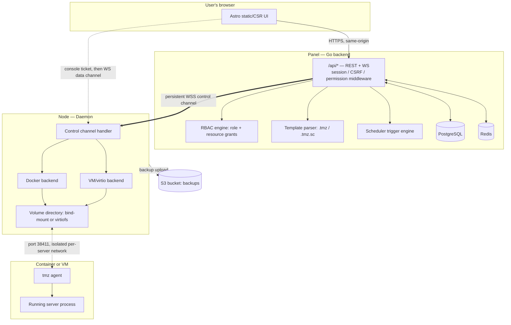

### 3.3 Trust boundaries

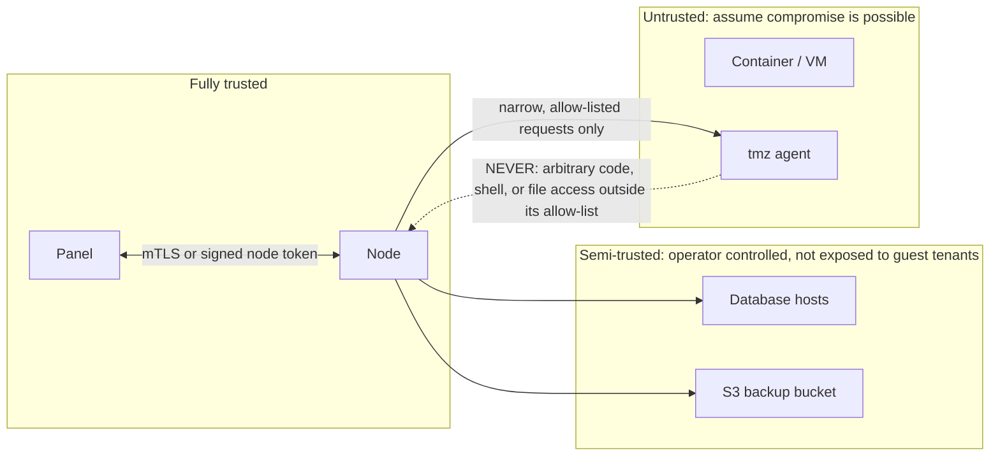

The single governing rule for every guest-facing protocol decision in this document: **the guest can be fully compromised and the blast radius must stop at the guest's own resources.** `tmz`'s allow-list, the per-server isolated network, and identity-by-channel (not by self-reported field) all exist to enforce this one rule.

## 4. Repository layout

Single monorepo for the panel; the Astro frontend is the one git submodule (own release cadence). Internal Go logic is ordinary packages — not submodules, not runtime plugins.

```
/panel
  /cmd
    /panel            -- main entrypoint
  /internal
    /auth             -- sessions, oauth, webauthn, totp
    /rbac             -- roles, permissions, resource grants
    /api              -- HTTP handlers, middleware chain
    /templates         -- .tmz / .tmz.sc parsing
    /scheduler         -- graph model, trigger engine (panel-side half)
    /nodes             -- node registry, bootstrap handshake, control channel
    /backends
      /docker          -- docker-specific provisioning request builders
      /vm               -- vm-specific provisioning request builders
    /db                -- postgres access layer (sqlc or similar generated code)
    /cache             -- redis client wrappers
    /audit             -- audit log writer
  /migrations          -- postgres schema migrations
  /web -> (git submodule) astro frontend, built to /internal/api/static

/daemon
  /cmd
    /daemon            -- main entrypoint, runs on each node
  /internal
    /control           -- control channel client, message dispatch
    /docker             -- docker backend implementation
    /vm                  -- qemu/virtio backend implementation
    /install             -- install-container orchestration
    /fs                  -- bind-mount / virtiofs volume management
    /net                 -- per-server isolated network setup
    /sftp                -- unified sftp server over local volume dirs

/tmz
  /cmd
    /tmz               -- in-guest agent entrypoint
  /internal
    /power              -- start/stop/restart/kill handling
    /sched               -- guest-side scheduler execution engine
    /customize           -- ps1/shebang/autocomplete push handling
    /update              -- self-update-when-stopped logic (mostly daemon-driven)
```

## 5. Data model (PostgreSQL schema)

This is the panel's own metadata store. Illustrative `CREATE TABLE` shapes — types and constraints to be refined at implementation time.

### 5.1 Identity & auth

```sql
CREATE TABLE users (
    id              UUID PRIMARY KEY DEFAULT gen_random_uuid(),
    email           CITEXT UNIQUE NOT NULL,
    username        CITEXT UNIQUE NOT NULL,
    password_hash   TEXT,                    -- NULL until invite is completed
    role_id         UUID NOT NULL REFERENCES roles(id),
    is_owner        BOOLEAN NOT NULL DEFAULT FALSE,  -- exactly one row may be TRUE, enforced below
    banned_at       TIMESTAMPTZ,
    created_at      TIMESTAMPTZ NOT NULL DEFAULT now(),
    created_by      UUID REFERENCES users(id)  -- NULL for the bootstrap owner
);

-- enforce "at most one owner" at the database level, not just app logic
CREATE UNIQUE INDEX one_owner_only ON users ((is_owner)) WHERE is_owner = TRUE;

CREATE TABLE invites (
    id              UUID PRIMARY KEY DEFAULT gen_random_uuid(),
    user_id         UUID NOT NULL REFERENCES users(id),
    token_hash      TEXT NOT NULL,
    expires_at      TIMESTAMPTZ NOT NULL,
    consumed_at     TIMESTAMPTZ,
    created_by      UUID NOT NULL REFERENCES users(id)
);

CREATE TABLE password_resets (
    id              UUID PRIMARY KEY DEFAULT gen_random_uuid(),
    user_id         UUID NOT NULL REFERENCES users(id),
    token_hash      TEXT NOT NULL,
    expires_at      TIMESTAMPTZ NOT NULL,
    consumed_at     TIMESTAMPTZ
);

CREATE TABLE oauth_identities (
    id              UUID PRIMARY KEY DEFAULT gen_random_uuid(),
    user_id         UUID NOT NULL REFERENCES users(id),
    provider        TEXT NOT NULL,           -- 'google' | 'github' | 'discord' | 'oidc:<config_id>'
    provider_uid    TEXT NOT NULL,
    linked_at       TIMESTAMPTZ NOT NULL DEFAULT now(),
    UNIQUE (provider, provider_uid)
);

CREATE TABLE oidc_providers (               -- admin-configured custom OIDC providers
    id              UUID PRIMARY KEY DEFAULT gen_random_uuid(),
    name            TEXT NOT NULL,
    issuer_url      TEXT NOT NULL,
    client_id       TEXT NOT NULL,
    client_secret_enc TEXT NOT NULL,        -- encrypted at rest
    scopes          TEXT[] NOT NULL DEFAULT '{openid,email,profile}',
    enabled         BOOLEAN NOT NULL DEFAULT TRUE
);

CREATE TABLE webauthn_credentials (
    id              UUID PRIMARY KEY DEFAULT gen_random_uuid(),
    user_id         UUID NOT NULL REFERENCES users(id),
    credential_id   BYTEA NOT NULL UNIQUE,
    public_key      BYTEA NOT NULL,
    sign_count      BIGINT NOT NULL DEFAULT 0,
    label           TEXT,                    -- "iPhone", "YubiKey", user-assigned
    created_at      TIMESTAMPTZ NOT NULL DEFAULT now()
);

CREATE TABLE totp_secrets (
    user_id         UUID PRIMARY KEY REFERENCES users(id),
    secret_enc      TEXT NOT NULL,           -- encrypted at rest
    enabled_at      TIMESTAMPTZ
);

CREATE TABLE totp_backup_codes (
    id              UUID PRIMARY KEY DEFAULT gen_random_uuid(),
    user_id         UUID NOT NULL REFERENCES users(id),
    code_hash       TEXT NOT NULL,
    used_at         TIMESTAMPTZ
);
```

### 5.2 RBAC

```sql
CREATE TABLE roles (
    id              UUID PRIMARY KEY DEFAULT gen_random_uuid(),
    name            TEXT UNIQUE NOT NULL,     -- 'owner' | 'admin' | 'user' | custom
    is_builtin      BOOLEAN NOT NULL DEFAULT FALSE,
    version         BIGINT NOT NULL DEFAULT 1 -- bumped on every permission change, used for session cache invalidation
);

CREATE TABLE permissions (
    id              UUID PRIMARY KEY DEFAULT gen_random_uuid(),
    key             TEXT UNIQUE NOT NULL      -- e.g. 'server.create', 'node.manage', 'user.ban'
);

CREATE TABLE role_permissions (
    role_id         UUID NOT NULL REFERENCES roles(id),
    permission_id   UUID NOT NULL REFERENCES permissions(id),
    PRIMARY KEY (role_id, permission_id)
);

CREATE TABLE server_grants (                 -- resource-level, independent of role
    id              UUID PRIMARY KEY DEFAULT gen_random_uuid(),
    server_id       UUID NOT NULL REFERENCES servers(id),
    user_id         UUID NOT NULL REFERENCES users(id),
    granted_by      UUID NOT NULL REFERENCES users(id),
    permissions     TEXT[] NOT NULL,          -- e.g. '{console.access}'
    created_at      TIMESTAMPTZ NOT NULL DEFAULT now(),
    UNIQUE (server_id, user_id)
);

CREATE TABLE resource_limits (               -- per-user caps, editable by owner/admin
    user_id         UUID PRIMARY KEY REFERENCES users(id),
    cpu_cores       NUMERIC,
    ram_mb          BIGINT,
    gpu_count       INT,
    storage_mb      BIGINT,
    bandwidth_mbps  INT,
    vm_creation_allowed BOOLEAN NOT NULL DEFAULT FALSE  -- default off for everyone except owner
);
```

### 5.3 Infrastructure

```sql
CREATE TABLE locations (
    id              UUID PRIMARY KEY DEFAULT gen_random_uuid(),
    short_name      CITEXT UNIQUE NOT NULL,   -- e.g. 'ins' for a datacenter short code
    name            TEXT NOT NULL,
    country         TEXT NOT NULL
);

CREATE TABLE nodes (
    id                  UUID PRIMARY KEY DEFAULT gen_random_uuid(),
    location_id         UUID NOT NULL REFERENCES locations(id),
    name                TEXT NOT NULL,
    short_name          CITEXT UNIQUE NOT NULL,  -- used for port allocation namespacing
    fqdn_or_ip          TEXT NOT NULL,
    ssl_enabled         BOOLEAN NOT NULL DEFAULT TRUE,
    sftp_port           INT NOT NULL,
    panel_port          INT NOT NULL,
    behind_proxy        BOOLEAN NOT NULL DEFAULT FALSE,
    docker_enabled      BOOLEAN NOT NULL DEFAULT TRUE,
    vm_enabled          BOOLEAN NOT NULL DEFAULT FALSE,
    cpu_cores_cap       NUMERIC NOT NULL,
    ram_mb_cap          BIGINT NOT NULL,
    gpu_count_cap       INT NOT NULL DEFAULT 0,
    storage_mb_cap      BIGINT NOT NULL,
    port_range_start    INT NOT NULL,
    port_range_end      INT NOT NULL,
    credential_fingerprint TEXT,              -- identifies the issued mTLS cert / signed token
    status              TEXT NOT NULL DEFAULT 'pending',  -- pending | online | offline | draining
    created_at          TIMESTAMPTZ NOT NULL DEFAULT now()
);

CREATE TABLE node_bootstrap_tokens (
    id              UUID PRIMARY KEY DEFAULT gen_random_uuid(),
    node_id         UUID NOT NULL REFERENCES nodes(id),
    token_hash      TEXT NOT NULL,
    expires_at      TIMESTAMPTZ NOT NULL,
    consumed_at     TIMESTAMPTZ
);

CREATE TABLE node_resource_usage (           -- rolling snapshot, updated from control-channel heartbeats
    node_id         UUID PRIMARY KEY REFERENCES nodes(id),
    cpu_allocated   NUMERIC NOT NULL DEFAULT 0,
    ram_allocated_mb BIGINT NOT NULL DEFAULT 0,
    gpu_allocated   INT NOT NULL DEFAULT 0,
    storage_allocated_mb BIGINT NOT NULL DEFAULT 0,
    updated_at      TIMESTAMPTZ NOT NULL DEFAULT now()
);

CREATE TABLE port_allocations (
    id              UUID PRIMARY KEY DEFAULT gen_random_uuid(),
    node_id         UUID NOT NULL REFERENCES nodes(id),
    server_id       UUID NOT NULL REFERENCES servers(id),
    port            INT NOT NULL,
    protocol        TEXT NOT NULL DEFAULT 'tcp',
    is_static       BOOLEAN NOT NULL DEFAULT FALSE,
    UNIQUE (node_id, port, protocol)
);
```

### 5.4 Templates & servers

```sql
CREATE TABLE image_templates (
    id              UUID PRIMARY KEY DEFAULT gen_random_uuid(),
    name            TEXT NOT NULL,
    backend         TEXT NOT NULL,            -- 'docker' | 'vm'
    version         INT NOT NULL DEFAULT 1,
    body_json       JSONB NOT NULL,           -- the parsed .tmz content
    created_by      UUID NOT NULL REFERENCES users(id),
    created_at      TIMESTAMPTZ NOT NULL DEFAULT now()
);

CREATE TABLE servers (
    id              UUID PRIMARY KEY DEFAULT gen_random_uuid(),
    owner_id        UUID NOT NULL REFERENCES users(id),
    node_id         UUID NOT NULL REFERENCES nodes(id),
    template_id     UUID NOT NULL REFERENCES image_templates(id),
    name            TEXT NOT NULL,
    description     TEXT,
    backend         TEXT NOT NULL,            -- 'docker' | 'vm'
    cpu_cores       NUMERIC NOT NULL,
    ram_mb          BIGINT NOT NULL,
    gpu_count       INT NOT NULL DEFAULT 0,
    storage_mb      BIGINT NOT NULL,
    status          TEXT NOT NULL DEFAULT 'installing',
    -- installing | install_failed | running | stopped | suspended | deleting
    install_attempts INT NOT NULL DEFAULT 0,   -- capped at 3
    volume_path     TEXT,                      -- resolved node-local directory
    created_at      TIMESTAMPTZ NOT NULL DEFAULT now()
);

CREATE TABLE server_variables (               -- resolved template variable values for this server
    server_id       UUID NOT NULL REFERENCES servers(id),
    key             TEXT NOT NULL,
    value           TEXT NOT NULL,
    PRIMARY KEY (server_id, key)
);

CREATE TABLE install_logs (
    id              UUID PRIMARY KEY DEFAULT gen_random_uuid(),
    server_id       UUID NOT NULL REFERENCES servers(id),
    attempt         INT NOT NULL,
    log_text        TEXT NOT NULL,
    succeeded       BOOLEAN,
    started_at      TIMESTAMPTZ NOT NULL DEFAULT now(),
    finished_at     TIMESTAMPTZ
);
```

### 5.5 Backups & databases

```sql
CREATE TABLE backups (
    id              UUID PRIMARY KEY DEFAULT gen_random_uuid(),
    server_id       UUID NOT NULL REFERENCES servers(id),
    destination_type TEXT NOT NULL,           -- 'location' | 'node'
    destination_id  UUID NOT NULL,            -- location_id or node_id depending on destination_type
    s3_bucket       TEXT NOT NULL,
    s3_key          TEXT NOT NULL,
    size_bytes      BIGINT,
    status          TEXT NOT NULL DEFAULT 'pending',  -- pending | uploading | complete | failed
    created_at      TIMESTAMPTZ NOT NULL DEFAULT now()
);

CREATE TABLE database_hosts (
    id              UUID PRIMARY KEY DEFAULT gen_random_uuid(),
    name            TEXT NOT NULL,
    engine          TEXT NOT NULL,            -- 'mysql' | 'postgres' | ...
    host             TEXT NOT NULL,
    port             INT NOT NULL,
    admin_user_enc   TEXT NOT NULL,           -- encrypted
    admin_pass_enc   TEXT NOT NULL,           -- encrypted
    max_databases    INT
);

CREATE TABLE server_databases (
    id              UUID PRIMARY KEY DEFAULT gen_random_uuid(),
    server_id       UUID NOT NULL REFERENCES servers(id),
    host_id         UUID NOT NULL REFERENCES database_hosts(id),
    db_name         TEXT NOT NULL,
    db_user         TEXT NOT NULL,
    db_pass_enc     TEXT NOT NULL,
    created_at      TIMESTAMPTZ NOT NULL DEFAULT now()
);
```

### 5.6 Scheduler & audit

```sql
CREATE TABLE schedules (
    id              UUID PRIMARY KEY DEFAULT gen_random_uuid(),
    server_id       UUID NOT NULL REFERENCES servers(id),
    name            TEXT NOT NULL,
    body_json       JSONB NOT NULL,           -- the .tmz.sc graph
    enabled         BOOLEAN NOT NULL DEFAULT TRUE,
    version         INT NOT NULL DEFAULT 1,   -- bumped on edit, used for guest push/confirm
    pushed_at       TIMESTAMPTZ,
    ack_at          TIMESTAMPTZ,              -- guest confirmed receipt of this version
    created_at      TIMESTAMPTZ NOT NULL DEFAULT now()
);

CREATE TABLE schedule_runs (
    id              UUID PRIMARY KEY DEFAULT gen_random_uuid(),
    schedule_id     UUID NOT NULL REFERENCES schedules(id),
    started_at      TIMESTAMPTZ NOT NULL DEFAULT now(),
    finished_at     TIMESTAMPTZ,
    status          TEXT,                     -- 'success' | 'failed' | 'running'
    log_text        TEXT
);

CREATE TABLE audit_log (
    id              UUID PRIMARY KEY DEFAULT gen_random_uuid(),
    actor_id        UUID REFERENCES users(id),
    action          TEXT NOT NULL,            -- e.g. 'server.stop', 'user.ban', 'node.create'
    target_type     TEXT,
    target_id       UUID,
    metadata        JSONB,
    created_at      TIMESTAMPTZ NOT NULL DEFAULT now()
);
```

## 6. Auth & identity

### 6.1 First-run setup


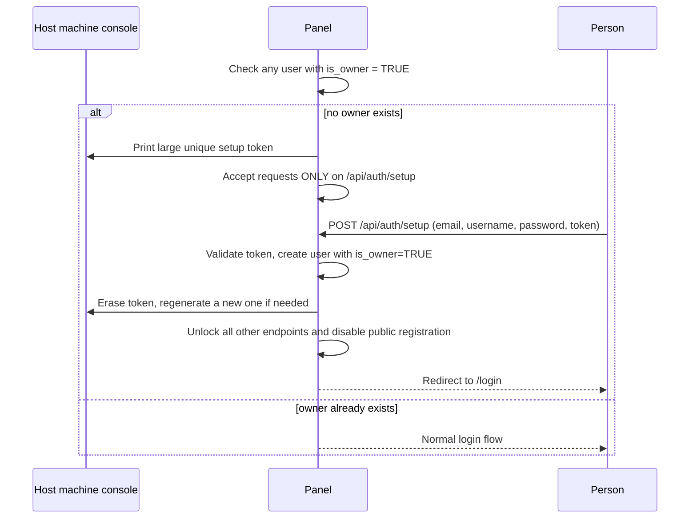


The setup token regenerates on every panel restart for as long as no owner exists — this prevents a stale, previously-printed token from being valid indefinitely if the first setup attempt is abandoned.

### 6.2 Post-setup account creation (invite flow)

Public self-registration is permanently disabled after the owner account is created. All subsequent accounts are created by an Admin or Owner:

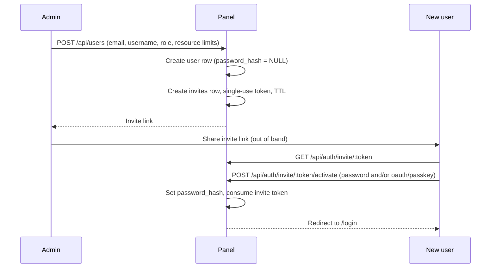

### 6.3 Login flow (password path)

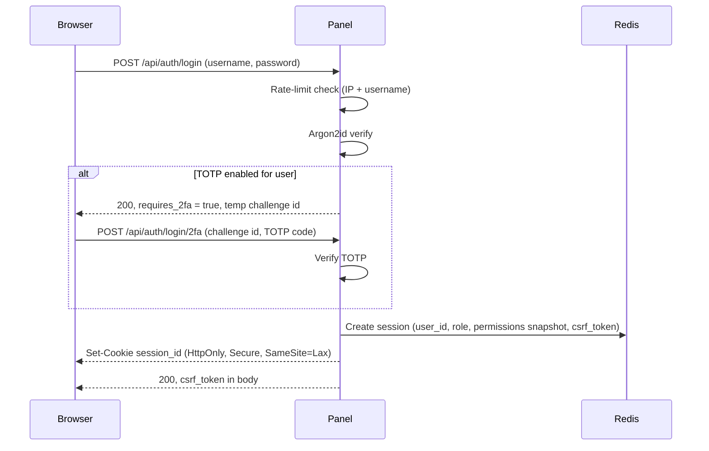

### 6.4 Credential mechanisms

| Mechanism | Storage | Notes |
|---|---|---|
| Password | Argon2id hash in `users.password_hash` | Never logged; never in access logs |
| OAuth (Google/GitHub/Discord) | `oauth_identities` | Links to existing account via verified email; not a signup path |
| Custom OIDC | `oidc_providers` + `oauth_identities` | Admin-configured issuer/client id/secret; arbitrary provider count |
| Passkey (WebAuthn) | `webauthn_credentials` | Multiple per account; uses `go-webauthn/webauthn` |
| TOTP 2FA | `totp_secrets`, `totp_backup_codes` | Secret encrypted at rest; backup codes hashed, single-use |
| Forgot password | `password_resets` | Single-use, 15-30 min TTL; response never reveals email existence |

### 6.5 Sessions

- Redis-backed, opaque session ID cookie (`HttpOnly`, `Secure`, `SameSite=Lax`).
- Web sessions: 1 hour idle timeout. Terminal/console sessions: **no idle timeout.**
- Session payload: `{user_id, role_id, permissions[], permissions_version, csrf_token, created_at, last_seen_at}`.
- Ban = `DEL session:<id>` for every session belonging to that user — instant, no token TTL to wait out. This is the deciding reason sessions were chosen over JWT.

### 6.6 Rate limiting tiers

| Tier | Key | Limit shape |
|---|---|---|
| Auth endpoints | IP + username | Strict; exponential backoff, never a flat lockout |
| Standard API | user or API key | Generous token bucket |
| Expensive ops (create server, trigger install, bulk queries) | user | Stricter bucket |
| Unauthenticated/public | IP | Tightest |

Implemented as Redis-backed Lua scripts (atomic check-and-increment) behind Go middleware.

### 6.7 Cookie consent

The session cookie is strictly necessary and must never be gated behind consent. The consent banner governs only genuinely optional cookies (analytics). Declining consent must never break login.

## 7. RBAC

### 7.1 Roles

| Role | Cardinality | Notes |
|---|---|---|
| Owner | exactly 1, DB-enforced | Unrestricted; fixed access to all resources on all nodes, not editable |
| Admin | many | Management + novelty features; add/delete/deactivate nodes, users, templates; ban users; edit normal users' resource limits |
| User | many | Own servers/resources only |
| Custom | many | Owner/Admin can define new roles with an arbitrary permission set |

### 7.2 Example permission keys

```
server.create
server.delete
server.start
server.stop
server.manage_any        -- bypasses per-server ownership check (owner/admin)
node.create
node.delete
node.manage
user.create
user.ban
user.edit_limits
template.create
template.delete
backup.create
backup.restore
```

### 7.3 Permission resolution

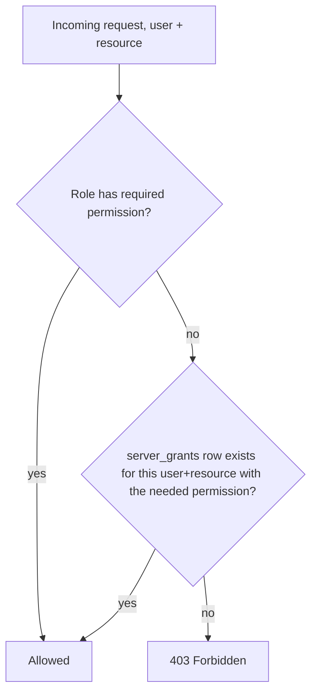

Role permission set is cached in the Redis session at login. A `role:<id>:version` counter (bumped on every role edit) is checked on each request — a mismatch triggers a cheap re-resolve from Postgres, so permission edits take effect on the user's very next request without a DB hit on every single call.

## 8. API design principles

- Same-origin: frontend at `/`, API at `/api/*`, no version prefix.
- Middleware chain, in order: session resolution → CSRF check (mutating methods only) → permission check (declarative per route) → handler-level ownership check (resource-specific, can't be generic middleware).
- CSRF: synchronizer token — generated at login, stored server-side in the session, returned once to the client, sent back as `X-CSRF-Token` on every mutating request.
- All mutating handlers must be idempotent-safe where retried (idempotency keys on install-trigger requests specifically).
- Every request that changes state writes an `audit_log` row: actor, action, target, metadata.

## 9. API reference (endpoint catalog)

### 9.1 Auth

| Method | Path | Description |
|---|---|---|
| POST | `/api/auth/setup` | First-run owner creation (only reachable pre-owner) |
| POST | `/api/auth/login` | Password login, step 1 |
| POST | `/api/auth/login/2fa` | TOTP verification, step 2 |
| POST | `/api/auth/logout` | Destroy current session |
| POST | `/api/auth/forgot-password` | Request reset email |
| POST | `/api/auth/reset-password/:token` | Complete reset |
| GET | `/api/auth/invite/:token` | Fetch invite details (email, role) |
| POST | `/api/auth/invite/:token/activate` | Set password / link credential, activate account |
| GET | `/api/auth/oauth/:provider/start` | Begin OAuth redirect |
| GET | `/api/auth/oauth/:provider/callback` | OAuth callback, link to existing account |
| POST | `/api/auth/webauthn/register/start` | Begin passkey registration |
| POST | `/api/auth/webauthn/register/finish` | Complete passkey registration |
| POST | `/api/auth/webauthn/login/start` | Begin passkey login |
| POST | `/api/auth/webauthn/login/finish` | Complete passkey login |
| POST | `/api/auth/totp/enroll` | Begin TOTP enrollment, returns secret + backup codes |
| POST | `/api/auth/totp/confirm` | Confirm enrollment with a valid code |
| GET | `/api/me` | Current user, role, permissions, csrf token |

### 9.2 Users & roles

| Method | Path | Description |
|---|---|---|
| GET | `/api/users` | List users (admin+) |
| POST | `/api/users` | Create user + invite (admin+) |
| PATCH | `/api/users/:id` | Edit user (role, limits) |
| POST | `/api/users/:id/ban` | Ban user, kills all sessions |
| POST | `/api/users/:id/unban` | Unban |
| DELETE | `/api/users/:id` | Delete user |
| GET | `/api/roles` | List roles |
| POST | `/api/roles` | Create custom role |
| PATCH | `/api/roles/:id/permissions` | Edit role's permission set, bumps version |

### 9.3 Locations & nodes

| Method | Path | Description |
|---|---|---|
| GET | `/api/locations` | List locations |
| POST | `/api/locations` | Create location |
| GET | `/api/nodes` | List nodes |
| POST | `/api/nodes` | Create node, returns setup link + bootstrap token |
| GET | `/api/nodes/:id` | Node detail, live resource usage |
| PATCH | `/api/nodes/:id` | Edit caps/toggles |
| DELETE | `/api/nodes/:id` | Deactivate/delete node |
| GET | `/nodes/setup/:shortname` | Node-facing bootstrap endpoint (not browser-facing) |

### 9.4 Templates

| Method | Path | Description |
|---|---|---|
| GET | `/api/templates` | List templates |
| POST | `/api/templates` | Upload `.tmz` file or submit interactive-builder JSON |
| GET | `/api/templates/:id` | Template detail |
| DELETE | `/api/templates/:id` | Delete template |

### 9.5 Servers

| Method | Path | Description |
|---|---|---|
| GET | `/api/servers` | List current user's servers (or all, for admin+) |
| POST | `/api/servers` | Create server (template, resources, backend choice) |
| GET | `/api/servers/:id` | Server detail, status, usage |
| POST | `/api/servers/:id/start` | Start |
| POST | `/api/servers/:id/stop` | Graceful stop |
| POST | `/api/servers/:id/kill` | Force kill |
| POST | `/api/servers/:id/restart` | Restart |
| POST | `/api/servers/:id/reinstall` | Re-run install |
| DELETE | `/api/servers/:id` | Delete |
| PATCH | `/api/servers/:id` | Rename, description |
| POST | `/api/servers/:id/grants` | Grant another user access (console, etc.) |
| DELETE | `/api/servers/:id/grants/:userId` | Revoke |
| PATCH | `/api/servers/:id/ports` | Switch dynamic to static, if permitted |
| POST | `/api/servers/:id/console/ticket` | Mint single-use console WS ticket |

### 9.6 Files

| Method | Path | Description |
|---|---|---|
| GET | `/api/servers/:id/files` | List directory (`?path=`) |
| GET | `/api/servers/:id/files/download` | Stream file down (`?path=`) |
| POST | `/api/servers/:id/files/upload` | Stream file up (`?path=`) |
| POST | `/api/servers/:id/files/rename` | `{from, to}` |
| POST | `/api/servers/:id/files/delete` | `{path}` |
| POST | `/api/servers/:id/files/mkdir` | `{path}` |
| POST | `/api/servers/:id/files/archive` | `{paths[], format}` |
| POST | `/api/servers/:id/files/extract` | `{path}` |

### 9.7 Backups & databases

| Method | Path | Description |
|---|---|---|
| GET | `/api/servers/:id/backups` | List backups |
| POST | `/api/servers/:id/backups` | Create backup, `{destination_type, destination_id}` |
| POST | `/api/backups/:id/restore` | Restore |
| DELETE | `/api/backups/:id` | Delete |
| GET | `/api/database-hosts` | List db hosts (admin+) |
| POST | `/api/database-hosts` | Register db host (admin+) |
| GET | `/api/servers/:id/databases` | List server's databases |
| POST | `/api/servers/:id/databases` | Provision a database |
| DELETE | `/api/servers/:id/databases/:dbId` | Delete |

### 9.8 Scheduler

| Method | Path | Description |
|---|---|---|
| GET | `/api/servers/:id/schedules` | List schedules |
| POST | `/api/servers/:id/schedules` | Create, body is the `.tmz.sc` graph |
| PATCH | `/api/schedules/:id` | Edit, bumps version, re-pushes to guest |
| DELETE | `/api/schedules/:id` | Delete |
| GET | `/api/schedules/:id/runs` | Run history |

## 10. Locations & Nodes

Locations are created first: unique short-name, free-text general name, country. Nodes are created under a Location, carrying: name, hard resource caps (CPU/GPU/RAM/storage — enforced by the daemon regardless of the machine's real hardware), Docker/VM capability toggles, FQDN/IP, a unique shortname (used for port-allocation namespacing), SSL toggle, SFTP port, panel-connection port, and a behind-proxy flag.

Locations currently serve two known purposes — node grouping, and backup destination selection (§21) — other uses are explicitly open **[OPEN]**.

## 11. Node bootstrap handshake

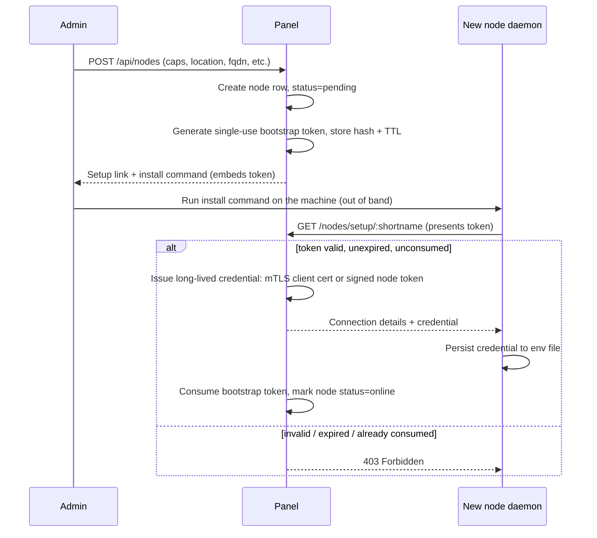

The security property here is **possession of a secret**, not "verifying the machine" — HTTP alone cannot prove machine identity, especially behind NAT/proxy, both supported cases. The bootstrap token is single-use specifically so a leaked or guessed setup URL cannot be raced by an attacker after the real node has already claimed it.

## 12. Panel ↔ Node control channel protocol

One persistent WSS connection per node, opened by the panel to the node, authenticated with the long-lived credential from the bootstrap handshake — not per-message auth.

### 12.1 Message envelope

```json
{
  "id": "req-<uuid>",
  "type": "server.start",
  "server_uuid": "...",
  "payload": {}
}
```

Responses correlate by `id`:

```json
{
  "id": "req-<uuid>",
  "type": "response",
  "status": "ok",
  "payload": {}
}
```

Unsolicited events carry no `id`:

```json
{
  "type": "event.status",
  "server_uuid": "...",
  "payload": { "cpu_pct": 12.4, "ram_mb": 512, "state": "running" }
}
```

### 12.2 Message type catalog

| Type | Direction | Purpose |
|---|---|---|
| `server.provision` | panel to node | Resolved create-server instruction (template + variables + resources) |
| `server.start` / `.stop` / `.kill` / `.restart` | panel to node | Lifecycle control |
| `server.delete` | panel to node | Teardown + volume cleanup |
| `event.status` | node to panel | Periodic heartbeat/usage |
| `event.install_log` | node to panel | Streamed install output |
| `event.install_result` | node to panel | Success/failure at end of install |
| `node.heartbeat` | node to panel | Liveness + aggregate resource usage |
| `tmz.update_flag` | node to panel | A server has been flagged need-to-update-tmz |

### 12.3 Data channels (separate from control)

- **Console**: per-session WS, authorized by a single-use ticket (see §19), never shares the control channel.
- **File transfer**: per-upload/download stream, so a large transfer never blocks lifecycle/status traffic for other servers on the same node.

## 13. Backends: Docker & VM

Both backends are Go packages compiled into the daemon (not runtime-loaded plugins), toggled per node via `docker_enabled` / `vm_enabled`. A template declares exactly one target backend; the panel routes provisioning requests to the matching node capability.

| Aspect | Docker | VM |
|---|---|---|
| Base | Pulled/pre-cached image | One of the node's hardcoded base VM configs |
| Provisioning mechanism | Install container | cloud-init |
| Volume access while running | Bind mount | virtiofs (9p fallback) |
| tmz binary swap while stopped | Direct filesystem access | Offline disk tooling (e.g. libguestfs-style mount) |
| Startup command execution | via tmz inside container | via tmz inside guest |

## 14. Image templates (`.tmz`)

Format: plain JSON (after iterating through systemd/INI-style and NestedText during design), parsed into Go structs. One template targets exactly one backend.

### 14.1 Docker template shape (illustrative)

```json
{
  "meta": {
    "name": "example-app",
    "backend": "docker",
    "version": 1,
    "author": "..."
  },
  "variables": [
    { "key": "PORT", "type": "int", "default": 8080, "required": true },
    { "key": "MEMORY_LIMIT", "type": "int", "default": 1024, "required": false }
  ],
  "docker": {
    "install_image": "ubuntu:22.04",
    "runtime_image": "example-app:latest",
    "install_commands": [
      "apt-get update && apt-get install -y curl",
      "curl -Lo /data/app.tar.gz https://example.com/app.tar.gz",
      "tar -xzf /data/app.tar.gz -C /data"
    ],
    "startup_command": "/data/app --port={{PORT}}",
    "expected_install_time_seconds": 120,
    "benchmarked_specs": { "cores": 4, "ram_mb": 4096, "storage_mbps": 200, "net_mbps": 100 }
  }
}
```

### 14.2 VM template shape (illustrative)

```json
{
  "meta": { "name": "example-vm", "backend": "vm", "version": 1 },
  "variables": [
    { "key": "HOSTNAME", "type": "string", "default": "server", "required": true }
  ],
  "vm": {
    "base_config": "ubuntu-22.04-cloudimg",
    "cloud_init_commands": [
      "apt-get update && apt-get install -y nginx",
      "hostnamectl set-hostname {{HOSTNAME}}"
    ],
    "startup_command": "systemctl start example-service",
    "expected_install_time_seconds": 300
  }
}
```

## 15. Install process

### 15.1 Docker install flow

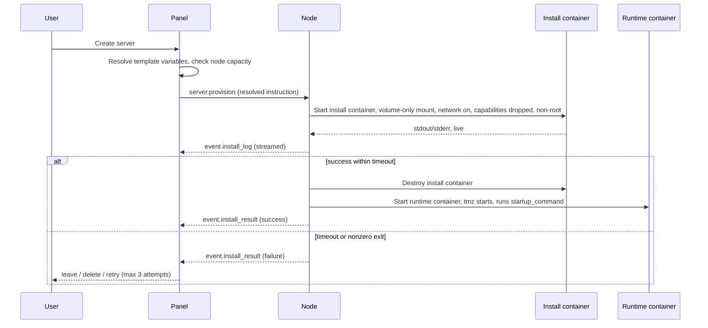

### 15.2 Install timeout scaling

- Base: `expected_install_time_seconds` from the template, benchmarked against `benchmarked_specs`.
- Scaled against the actual node's specs, weighted toward whichever resource the install is primarily bound by (network / CPU / disk / mixed) rather than one blended ratio.
- Safety multiplier (~1.3-1.5x) applied on top of the scaled estimate.
- Hard floor and ceiling regardless of scaling result.
- **Absolute hard cap: 2 hours by default**, adjustable by admins.

### 15.3 Failure handling

Three options presented to the user on failure: leave unfinished, delete, or retry. Retries capped at 3 attempts; the volume is wiped before each retry unless a template explicitly opts into resumable installs.

## 16. Server lifecycle

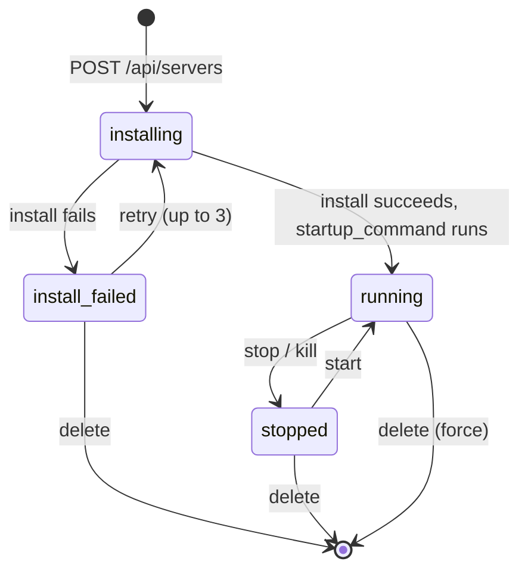

Fields shown on server creation depend on the Docker/VM choice and are matched against the selected template's declared `variables`. VM creation is opt-in per user (`resource_limits.vm_creation_allowed`) — the Owner has it by default, everyone else must be explicitly granted it.

## 17. Port allocation

- Each node has a configured range (`port_range_start`/`port_range_end`).
- Dynamic allocation (default): pick the next free port in range for the node.
- Static allocation: an admin/owner can grant a specific user a fixed port for a given server.
- Reservation must be atomic — a DB transaction or a Postgres advisory lock on the node row — to avoid two simultaneous server creations racing onto the same port.

## 18. `tmz` — the in-guest agent

### 18.1 Role

A single Go binary, cross-compiled per architecture by the panel, installed by default at a fixed path inside every container/VM. Described explicitly as an **orchestrator, not a thin bridge**:

- Executes the startup command on boot (uniform across Docker and VM backends).
- Executes scheduled jobs locally, inside the guest.
- Handles power-action requests originating from inside the guest.
- Delivers customization data pushed from the node (PS1, shebangs, autocomplete history).

### 18.2 Transport

After a server starts, a listener on a fixed port (currently 38411) runs inside that server's own **isolated network** — reusable across every server since each server's network is isolated from every other server and from the outside world. `tmz` connects **out** to this port.

Isolation must be structurally real:
- Docker: one dedicated network per container, not a shared bridge relying on ICC rules.
- VM: one dedicated bridge/tap per VM.

**Identity is bound to the channel, never to a self-reported field.** The node already knows which isolated network maps to which server UUID from provisioning time.

### 18.3 Trust boundary (explicit invariant)

`tmz` must never be able to send arbitrary code to the host or otherwise become a breach path outward. It can only:
1. Receive code/instructions from the host to execute inside the guest (startup command, scheduled job payload).
2. Make requests to the host from a small, closed, hardcoded enum — never a generic type-to-executor mapping.

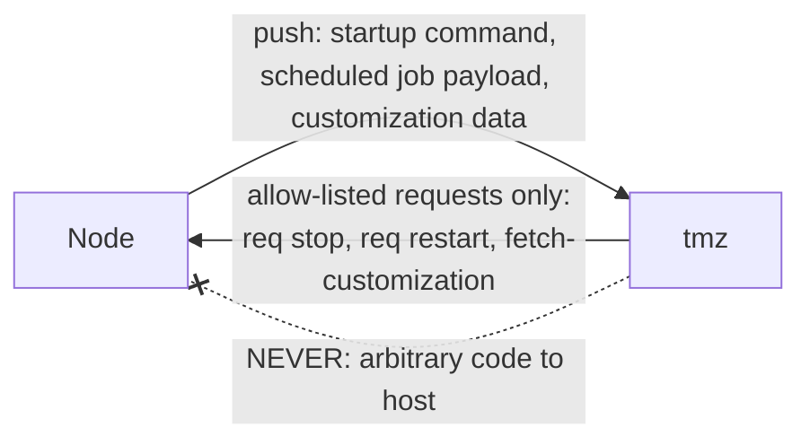

Every request type is validated against the closed enum and rate-limited per type per server.

### 18.4 Update flow

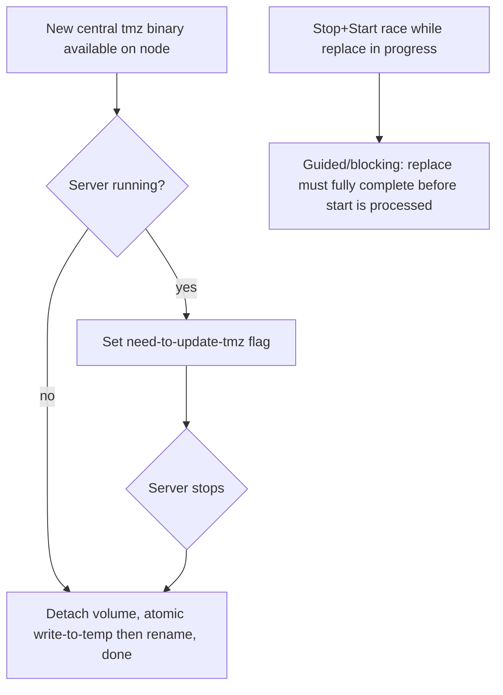

Docker vs VM asymmetry: a stopped container's filesystem is directly host-reachable; a stopped VM's disk needs offline disk tooling as its own code path.

## 19. Console

- PTY-based, genuine SSH-like session — commands typed directly into the terminal.
- Embedded inline in the dashboard (not a popup or iframe).
- Autocomplete from the user's own past command history, delivered via tmz's customization channel.
- Side panel: force-kill, graceful-kill, restart — replaced by a Start button once killed. Live usage stat cards/graphs below.
- Owner cannot open another user's console without that user granting permission (via `server_grants`), but can still delete/suspend regardless.

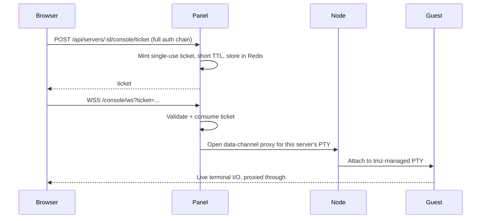

## 20. File management

- Feature set: browse, upload, download, extract, zip, rename, move — plus direct SFTP access to the volume.
- VM filesystems stay live-accessible the whole time the VM is running via **virtiofs** (9p as an older-guest fallback) — never by touching a live VM's raw disk image from the host directly.
- This unifies the Docker and VM code paths: both resolve "a server's volume" to an ordinary directory on the node's own filesystem (bind-mount for Docker, virtiofs-shared for VM) — one file-manager implementation, one SFTP server implementation, no backend-specific branching.
- Path traversal defense enforced independently on both the panel and the node (canonicalize, reject `..`, verify the resolved path stays within the server's designated data directory) — never relying on a single layer as the only defense.

## 21. Backups

- Storage: S3-compatible bucket.
- At creation time, the user selects either a **Location** (nearest/appropriate node in that location handles it) or a **specific node** directly.
- Mechanism differs by backend **[OPEN]**: Docker backups can be a straightforward archive of the data directory; a VM backup likely needs a proper qcow2 snapshot (internal or external-with-backing-file) to capture full guest/OS state rather than just the shared data directory. Final call pending.

## 22. Databases (user-facing hosting)

Distinct from the panel's own Postgres. A **Database Host** is registered once (admin), then per-server "create database" requests provision a scoped user+schema on it, with credentials surfaced (and rotatable) to the server owner. Structurally similar to how Nodes are managed.

## 23. Scheduler (`.tmz.sc`)

### 23.1 Model

A directed graph — blocks are nodes, connections are edges, branching on success/failure/condition — not a flat linear list. Execution happens **inside the guest, via tmz**, which is what lets scheduling generalize uniformly across Docker and VMs and keeps schedules running through brief panel/node outages.

### 23.2 Illustrative shape

```json
{
  "meta": { "name": "nightly-backup", "version": 3 },
  "blocks": {
    "start": { "type": "start", "next": "take_backup" },
    "take_backup": { "type": "action.backup", "next": "restart_server" },
    "restart_server": {
      "type": "action.restart",
      "on_success": "done",
      "on_failure": "notify_fail"
    },
    "notify_fail": { "type": "action.notify", "next": "done" },
    "done": { "type": "end" }
  },
  "functions": {
    "cleanup_old_backups": {
      "params": ["keep_count"],
      "blocks": { "...": "..." }
    }
  },
  "settings": {
    "trigger": "cron:0 3 * * *",
    "retry_on_fail": 3,
    "when": "lastRunStatus == 'failed' && retryCount < 3"
  }
}
```

The outer structure (blocks/functions/settings) is plain JSON parsed by the panel's own structures. Condition/argument expressions (the `when` field, function call arguments) are evaluated at runtime via a small embeddable Go expression evaluator layered on top of the parsed structure — not a hand-rolled parser — while the outer JSON shape stays custom.

### 23.3 Edit/push flow

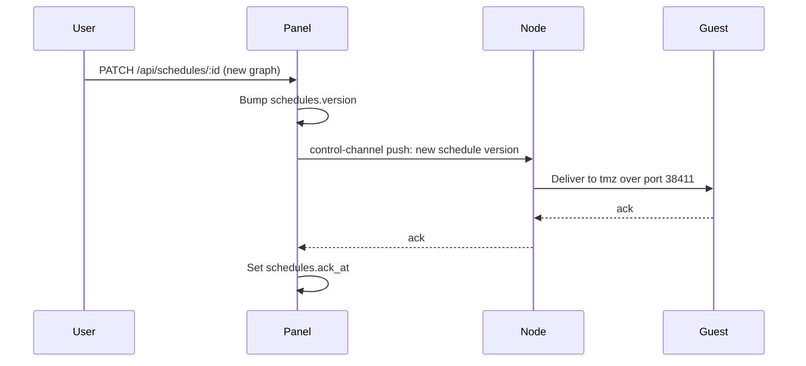

## 24. Assets / CDN

Static assets served under an `/assets` route on the panel's own domain, or optionally a separate subdomain, functioning like a lightweight CDN. Hashed filenames get long immutable cache headers; `index.html`/unhashed HTML gets no-cache.

## 25. Addons (deferred)

- Addon UI: plain HTML/CSS/JS/TS, running its logic as its own sandboxed, burstable process talking to the Go API from inside the sandbox.
- Direct-access permissions are a hard limit by default; an addon must declare a special tag to request elevated access, and the user must accept an explicit warning/legal notice to grant it.
- An addon is either embedded in the panel or a separate site alongside it, declared in its manifest; the manifest's UI API must be disabled to use fully custom components.
- Addons interact with each other only if one explicitly lists the other as a dependency.
- Full design deferred to a later pass.

## 26. Threat model summary

| Threat | Mitigation |
|---|---|
| Compromised guest tries to control the node/host | tmz's closed request enum; identity bound to isolated network channel, not self-reported field |
| Compromised guest tries to reach another server's guest | Per-server dedicated Docker network / VM bridge, not a shared bridge with ICC rules |
| Node setup URL guessed/intercepted before real node claims it | Single-use, time-limited bootstrap token separate from the shortname |
| Session/cookie theft | HttpOnly/Secure/SameSite cookie; console access additionally uses single-use short-TTL tickets, never the raw session on a WS URL |
| CSRF | Synchronizer token, required on all mutating requests |
| Credential stuffing / brute force | Rate limiting keyed by IP and username together, exponential backoff, never a flat lockout |
| IDOR (acting on another user's resource) | Handler-level ownership check on every resource-scoped endpoint, independent of route-level auth |
| Path traversal in file manager | Canonicalize and validate on both panel and node independently |
| Stale permissions after a role edit | `role:<id>:version` counter checked per request, cheap re-resolve on mismatch |
| Interrupted tmz binary replace corrupting the agent | Atomic write-to-temp-then-rename, never in-place overwrite |
| Live VM disk corruption from host-side file access | virtiofs/9p live-share instead of ever touching the raw disk image directly |
| Node oversubscription past declared caps | Capacity check against `node_resource_usage` before accepting a create-server request |

## 27. Open questions

- **VM backup mechanism**: full-disk snapshot vs. data-directory-only (§21).
- **Kubernetes / bare-metal**: out of scope for now, revisit later if needed.
- **Automatic node placement**: deferred in favor of manual placement.
- **Scheduler expression library**: needs a concrete choice (e.g. an existing embeddable Go expression evaluator) for `when`/argument fields.
- **Locations' full purpose**: currently node grouping + backup destination; other uses left open.
- **Addon system**: full design not yet started.
- **Go library support for any remaining bespoke serialization needs**: verify availability before committing further to hand-rolled parsers beyond what's already decided (JSON for `.tmz`/`.tmz.sc`).

## 28. Glossary

| Term | Meaning |
|---|---|
| Panel | The central Go backend + Astro frontend; source of truth |
| Node | A managed machine running the daemon |
| Daemon | The Go binary running on a Node |
| tmz | The narrow in-guest agent running inside every container/VM |
| Location | A grouping of Nodes (datacenter/region) |
| Template (`.tmz`) | A JSON file describing how to provision a Docker or VM server |
| Schedule (`.tmz.sc`) | A JSON graph describing recurring/conditional jobs for a server |
| Install container | An ephemeral, volume-scoped container that runs a Docker template's install steps |
| Resource grant | A per-user, per-server permission independent of role (e.g. shared console access) |
